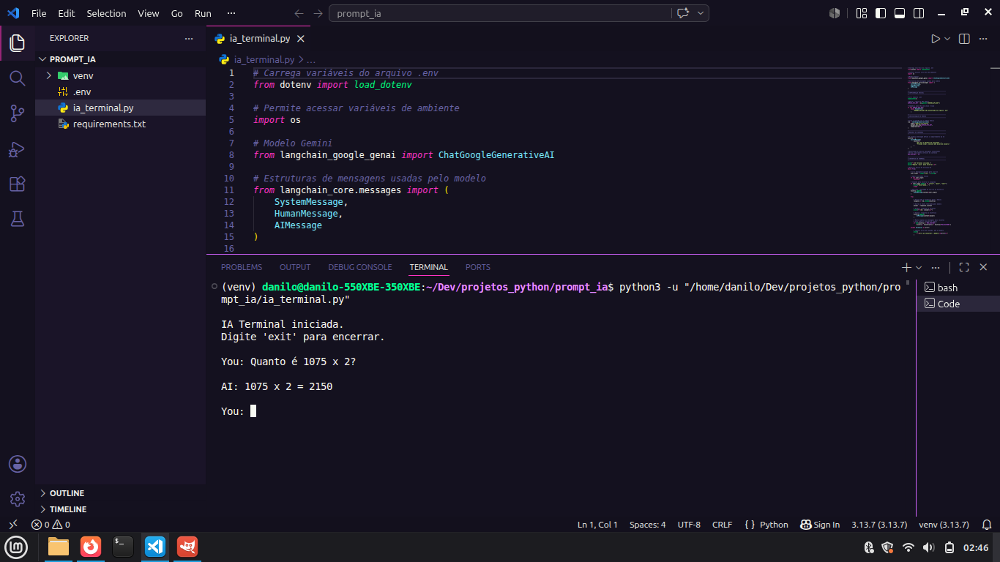

# 🤖 Terminal AI Agent (Gemini + LangChain)


## 📌 Descrição

Assistente de IA para terminal desenvolvido em Python utilizando o modelo Gemini e a biblioteca LangChain.

O projeto demonstra os fundamentos da construção de aplicações baseadas em Large Language Models (LLMs), incluindo gerenciamento de contexto, engenharia de prompts, integração com APIs e uso de variáveis de ambiente.

Foi desenvolvido com foco em aprendizado de agentes de IA modernos e integração de modelos de linguagem em aplicações Python.

---

## 📷 Preview

<p align="center">
  
</p>

---

## 🚀 Funcionalidades

- 💬 Conversação em linguagem natural
- 🧠 Memória de contexto durante a sessão
- ⚡ Integração com Gemini 2.5 Flash
- 🖥️ Execução totalmente via terminal
- 🔒 Utilização de variáveis de ambiente para proteção da API Key
- 🧹 Controle automático do histórico para reduzir consumo de tokens
- 🛑 Comando para encerramento da aplicação

---

## 🛠️ Tecnologias utilizadas

- Python 3
- LangChain
- Gemini API
- Python Dotenv

---

## 📚 Conceitos abordados

Este projeto explora conceitos fundamentais utilizados no desenvolvimento de aplicações baseadas em modelos de linguagem (LLMs) e agentes de IA.

### 🤖 Integração com LLMs

Comunicação com modelos de linguagem através da API Gemini utilizando a biblioteca LangChain.

### 📝 Engenharia de Prompt

Definição de instruções de sistema (System Prompt) para controlar o comportamento, estilo e objetivo das respostas geradas pelo modelo.

### 🧠 Gerenciamento de Contexto

Manutenção do histórico da conversa para permitir respostas contextualizadas durante a sessão.

### 🔐 Variáveis de Ambiente

Utilização de arquivos `.env` para armazenamento seguro de credenciais e chaves de acesso.

### 🌐 Consumo de APIs

Integração com serviços externos por meio de requisições à API do Gemini.

### ⚙️ Desenvolvimento de Agentes de IA

Implementação da estrutura básica de um assistente conversacional utilizando modelos de linguagem modernos.

### 🏗️ Arquitetura Cliente–Modelo

Separação entre interface de interação (terminal) e processamento realizado pelo modelo de IA.

### 📦 Gerenciamento de Dependências

Utilização de ambiente virtual e bibliotecas especializadas para construção da aplicação.

---

## 🧱 Estrutura do projeto

```text
📂 terminal-ai-agent/
│
├── ia_terminal.py      # Aplicação principal
├── .env.example        # Modelo de configuração
├── requirements.txt    # Dependências do projeto
├── preview.png         # Captura de tela da aplicação
├── LICENSE             # Licença MIT
└── README.md           # Documentação
```

---

## 🧠 Arquitetura

```text
Usuário
   │
   ▼
Terminal
   │
   ▼
LangChain
   │
   ▼
Gemini 2.5 Flash
   │
   ▼
Resposta
```

A cada interação, o histórico da conversa é enviado ao modelo, permitindo respostas contextualizadas.

---

## ▶️ Como executar

### 1. Clone o repositório

```bash
git clone git https://github.com/danilo-santosdev/terminal-ai-agent.git
```

### 2. Entre no diretório

```bash
cd terminal-ai-agent
```

### 3. Instale as dependências

```bash
pip install -r requirements.txt
```

### 4. Crie o arquivo .env

Copie o modelo de configuração:

```bash
cp .env.example .env
```

Edite o arquivo:

```env
GEMINI_API_KEY=SUA_CHAVE_AQUI
```

### 5. Execute o projeto

```bash
python ia_terminal.py
```

---

## 📦 Dependências

```text
langchain
langchain-google-genai
python-dotenv
```

Ou:

```bash
pip install langchain langchain-google-genai python-dotenv
```

---

## ⚠️ Limitações

- Não possui memória persistente entre execuções
- Não realiza pesquisas na internet
- Não executa ações externas
- Não possui ferramentas (tools) integradas
- Histórico armazenado apenas em memória RAM

---

## 🔮 Melhorias futuras

- 💾 Memória persistente com SQLite
- 📂 Leitura e escrita de arquivos
- 🌐 Integração com pesquisa web
- 🧰 Ferramentas personalizadas (Tools)
- 🤖 Arquitetura baseada em agentes
- 📊 Sistema de logs
- 🐳 Containerização com Docker

---

## 📜 Licença

Distribuído sob a Licença MIT.

Este projeto é open source e pode ser utilizado livremente para fins educacionais e de aprendizado.

---

### 👨‍💻 Autor

**Danilo Santos**  
🐙 GitHub: https://github.com/danilo-santosdev
🌐 Repositório: https://github.com/danilo-santosdev/terminal-ai-agent

---

⭐ Se este projeto foi útil para você, considere deixar uma estrela no repositório.
